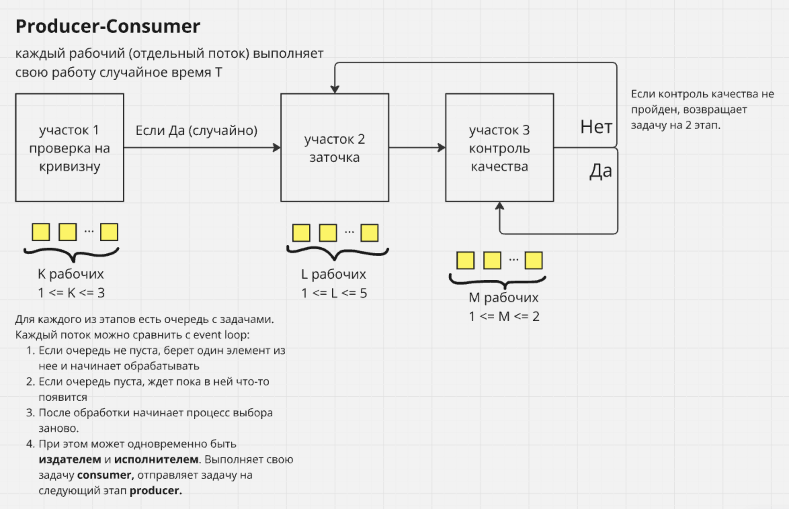
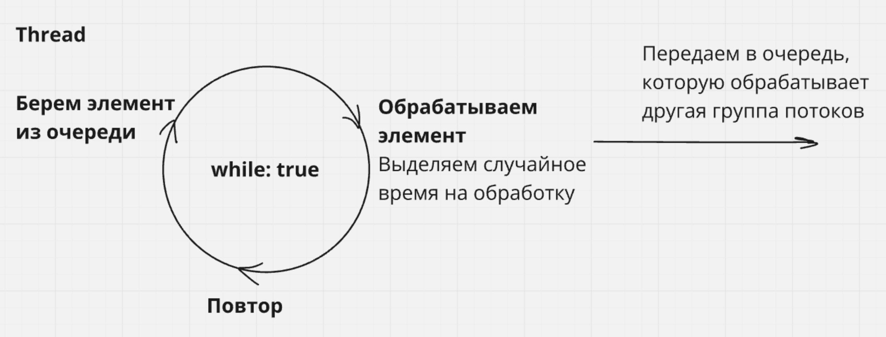

# Understanding threads in C++ with POSIX threads.

## Task description:
> In the pin sharpening workshop, all necessary operations are carried out by workers at three production sites. In the first section, 1 ≤ K ≤ 3 workers receive blunt pins and for some random time each of them checks it for curvature. If the pin is not curved, then the worker transfers it to the second section, where 1 ≤ L ≤ 5 workers sharpen. A randomly selected free worker performs sharpening and transfers the sharpened pin to the third site, where 1 ≤ M ≤ 2 carry out quality control of the operation.

### Notes:
1. This multithreaded application simulates the work of the workshop and uses the "producer-consumer" paradigm.
2. Each employee is a separate thread.
3. Each of the operations is performed in a random time that is not associated with a specific worker.
4. This program uses buffers(queue) to transfer data between threads.
5. Pins are transferring one by one through the buffer.
6. Since the task does not specify under what conditions it's necessary to shut down the program, the application shuts down when the specified time expires. This can be compared to a factory worker's working day.
7. Arguments should be passed through the application run command. Like this: **program K L M**, where K is count of workers in first workshop in [1, 3], L is count of workers in second workshop in [1, 5] and M is count of workers in third workshop in [1, 2]. 

This image describes how it works.

> More details described in program comments.

And this image describes how each thread works.

### Random values generation
For generation used "random" library, that generates pseudo-random values, but it thread-safe.

### Example of program output
[Stage 1 Worker] Passed a pin {1} to Stage 2. Buffer size: 1  
[Stage 2 Worker] Received a pin {1} from Stage 1. Buffer size: 0  
[Stage 1 Worker] Discarded a curved pin {0}.  
[Stage 2 Worker] Passed a sharpened pin {1} to Stage 3. Buffer size: 1  
[Stage 3 Worker] Received a sharpened pin {1} from Stage 2. Buffer size: 0  
[Stage 1 Worker] Discarded a curved pin {3}.  
[Stage 1 Worker] Passed a pin {2} to Stage 2. Buffer size: 1  
[Stage 2 Worker] Received a pin {2} from Stage 1. Buffer size: 0  
[Stage 3 Worker] quality control OK on a pin {1}.  
[Stage 3 Worker] Received a sharpened pin {2} from Stage 2. Buffer size: 0  
[Stage 2 Worker] Passed a sharpened pin {2} to Stage 3. Buffer size: 0  
[Stage 3 Worker] quality control OK on a pin {2}.  

